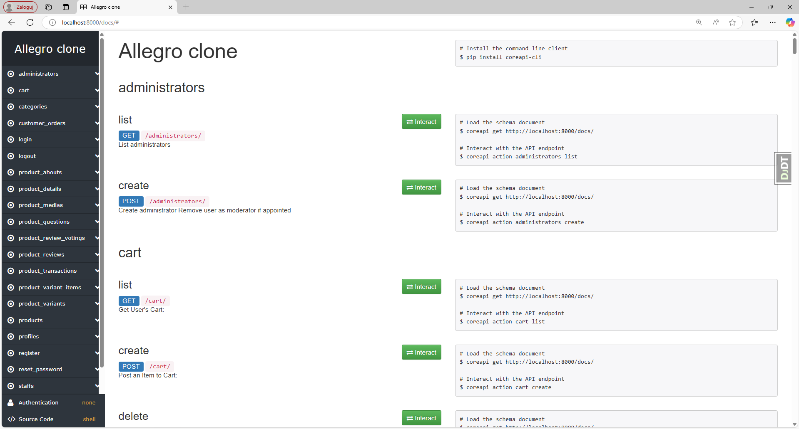

# Overview

Allegro Clone API is a demo implementation of a popular Polish e-commerce platform, similar to Amazon. This repository 
serves as the backend for the clone, offering a functional REST API.

While the backend is under active development, the [frontend](https://github.com/emge1/allegro-clone-frontend) is also 
in progress and will integrate with this API to simulate the full e-commerce platform experience.

Additionally, we are developing a [payment simulation microservice](https://github.com/emge1/payment_simulation) in Java, which will enhance the platform's 
functionality and simulate real-world payment processes.

# Table of contents
* [Example screenshots](#example-screenshots)
* [Functionalities](#functionalities)
  * [Key Functionalities](#key-functionalities)
  * [Features](#features)
* [Project setup](#project-setup)
  * [Using Virtual Environment](#using-virtual-environment)
  * [Using Docker Compose](#using-docker-compose)
* [Dependencies](#dependencies)
  * [Backend](#backend)
  * [Frontend](#frontend)
  * [Payment simulation microservice](#payment-simulation-microservice)
* [Entity Relationship Diagram](#entity-relationship-diagram)
* [API documentation](#api-documentation)


# Demo - example screenshots


# Functionalities

## Key functionalities
* Models for core e-commerce elements like users, products, and orders.
* Serializers and views for handling data and API endpoints.
* Test coverage to ensure reliability.
* Integration with Github Actions: 
  * CI workflow, including testing and building,
  * Trivy to ensure cybersecurity by scanning Docker images on each pull request and main branch push.
* Support for both local development and production environments using Docker and docker-compose.
* Development logging outputs debug-level logs to the console for effective debugging with Django Debug Toolbar.
* Production-Grade Logging and Monitoring:
  * Configured logging in production to filter sensitive information and ensure compliance with security best practices,
  * Integrated Prometheus for metrics collection and Grafana for real-time performance visualization and system monitoring.

## Features
* Registration as a merchant or a customer
* Automatic creation of cart and profile while registration
* Login authentication
* Authorization with access token
* Display random products and the cheapest one on the home page
* Display itmes and subcategories on a category page
* Display details of an item
* Add an item to personal cart
* Access to a cart only for authorized users

# Project setup

## Using Virtual Environment

Clone the repository:
```bash
git clone https://github.com/emge1/allegro-clone-api.git
cd allegro-clone-api
```
Create .env file and add the secret key:
```bash
echo "SECRET_KEY=secret_key" > .env
```
Set up a virtual environment:

```bash
python -m venv venv
venv\Scripts\activate.bat
```
Install dependencies:
```bash
pip install -r requirements/local.txt 
```
Apply database migrations:
```bash
python manage.py migrate
```
Load sample data - run load_sample_data.sh:
``` bash
./load_sample_data.sh

# optionally, if "/usr/bin/env: ‘bash\r’: No such file or directory":
sed -i 's/\r$//' ./load_sample_data.sh 

# and rerun
./load_sample_data.sh
```
Start the development server:
```bash
python manage.py runserver
```

Access the application at http://localhost:8000/.

To experience the fullstack application, please set up the [frontend](https://github.com/emge1/allegro-clone-frontend) as well.

## Using Docker Compose

Clone both backend and the frontend repository:

```bash
git clone https://github.com/emge1/allegro-clone-api.git
git clone https://github.com/emge1/allegro-clone-frontend.git
cd allegro-clone-api
```
Create .env file and add the secret key:

```bash
echo "SECRET_KEY=secret_key" > .env
```
And run docker compose:
```bash
docker compose up web frontend
```
Access the application at http://localhost:3000/.

# Dependencies
## Backend
### Base
* Django
* Django Rest Framework
* Python Decouple
* Pillow
* Django Cors Headers

### Local
* Django Debug Toolbar
* Pytest
* Pytest Django
* Pytest Cov
* Pytest JUnitXML
* SQLite

### Prodcution
* Postgres 
* Prometheus Client

## Frontend
* React
* Axios

## Payment simulation microservice
* Spring Boot Starter Web
* Spring Boot Starter Data JPA
* Spring Boot Starter AMQP
* MySQL Connector
* Lombok
* Spring Boot Starter Test

# Entity Relationship Diagram 
Below is the Entity Relationship Diagram (ERD) illustrating the relationships between the key entities in this project. Click on the image to view it in a larger size.


# API documentation

To access the API documentation, start the development server and navigate to:
 http://localhost:8000/docs/

Below is a screenshot of part of the documentation.
To view a screenshot displaying all possible HTTP methods and endpoints, please click [here](media/readme/localhost_8000_docs_.jpeg).


