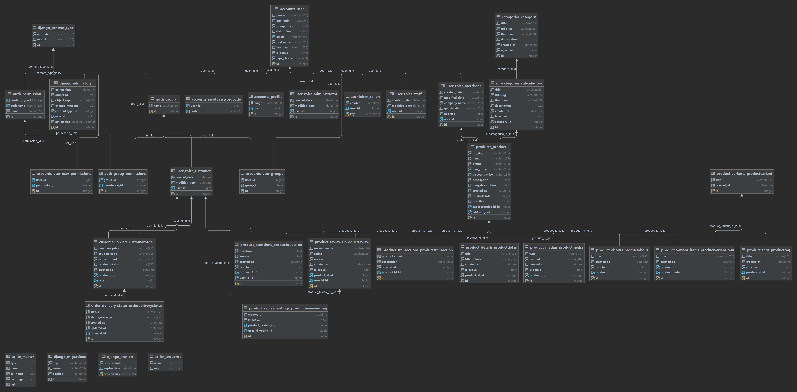

# Overview

Allegro Clone API is a demo implementation of a popular Polish e-commerce platform, similar to Amazon. This repository serves as the backend for the clone, offering a functional REST API.

Key functionalities include:

* Models for core e-commerce elements like users, products, and orders.
* Serializers and views for handling data and API endpoints.
* Test coverage to ensure reliability.
* GitHub Actions for automated CI workflows, including testing and building.
* Support for both local development and production environments using Docker and docker-compose.
* GitHub Actions with Trivy to ensure cybersecurity by scanning Docker images on each pull request and main branch push.


While the backend is under active development, the [frontend](https://github.com/emge1/allegro-clone-frontend) is also in progress and will integrate with this API to simulate the full e-commerce platform experience.


# Table of contents

* [Project setup](#project-setup)
  * [Using Virtual Environment](#using-virtual-environment)
  * [Using Docker Compose](#using-docker-compose)
* [Dependencies](#dependencies)
* [Entity Relationship Diagram](#entity-relationship-diagram)
* [API documentation](#api-documentation)
* [Example screenshots](#example-screenshots)

# Project setup

## Using Virtual Environment

Clone the repository:

```
git clone https://github.com/emge1/allegro-clone-api.git
cd allegro-clone-api
```

Set up a virtual environment:

```
python -m venv venv
venv\Scripts\activate.bat
```

Install dependencies:

```
pip install -r requirements/local.txt 
```

Apply database migrations:

```
python manage.py migrate
```

Start the development server:
```
python manage.py runserver
```

Access the application at http://127.0.0.1:8000/

## Using Docker Compose

### Only Local Developmnet (backend)
Clone the repository:

```
git clone https://github.com/emge1/allegro-clone-api.git
cd allegro-clone-api
```

Build and run the services depending on the environment:

* Local Development (backend only)
```
docker-compose -f up -d web
```

Access the application at http://127.0.0.1:8000/.

### Local Developmnet with GUI

```
git clone https://github.com/emge1/allegro-clone-api.git
git clone https://github.com/emge1/allegro-clone-frontend.git
cd allegro-clone-api
```

Build and run the services depending on the environment:

```
docker-compose -f up -d web frontend
```

Access the application at http://127.0.0.1:3000/.

# Dependencies
## Backend
### Base
* Django
* Django Rest Framework
* Python Decouple
* Pillow
* Django Cors Headers
* Prometheus Client

### Local
* Django Debug Toolbar
* Pytest
* Pytest Django
* Pytest Cov
* Pytest JUnitXML
* SQLite (local)

### Prodcution
* Postgres (production)

## Frontend
* React
* Axios

# Entity Relationship Diagram 
Below is the Entity Relationship Diagram (ERD) illustrating the relationships between the key entities in the project. Click on the image to view it in a larger size.



# API documentation

To access the API documentation, start the development server and navigate to:
http://127.0.0.1:8000/docs/

Below is a screenshot of the documentation as seen by a non-authenticated user.
To view a screenshot displaying all possible HTTP methods and endpoints for authenticated users, click [here](media/localhost_8000_docs_.png).
To view API documentation, run development server and visit http://127.0.0.1:8000/docs/


# Example screenshots


